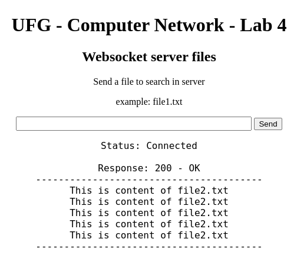

## Computer Network - Lab 4

<p align="center">
  
</p>

To run this project you can use the file already compiled

To run with file already compiled:

```
./main
```

And then open `client.html` to connect to socket

If you want compile the project with Go compiler run:
```
go build -o main
```